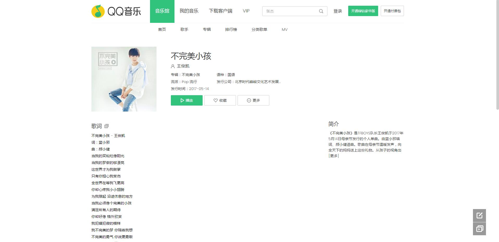
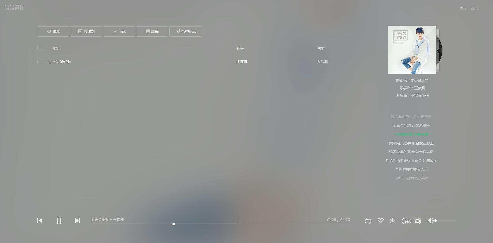
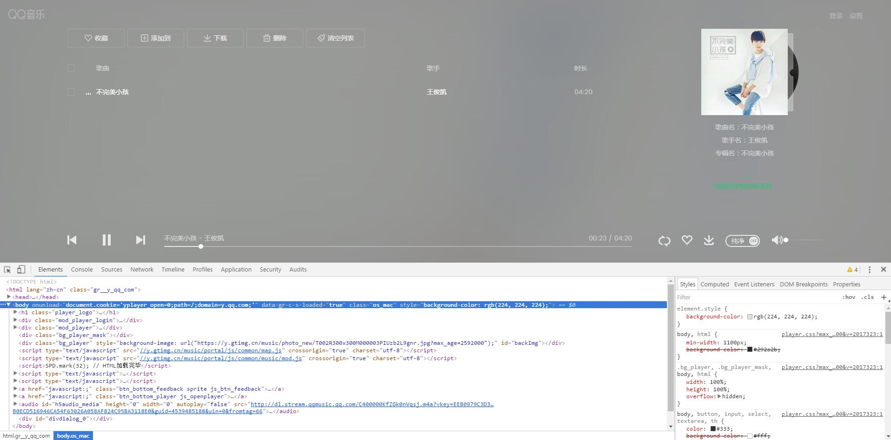
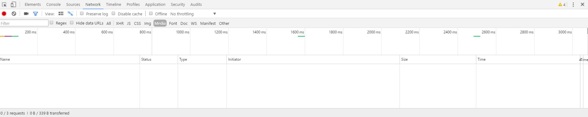
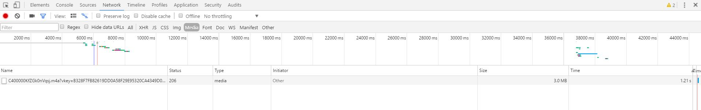
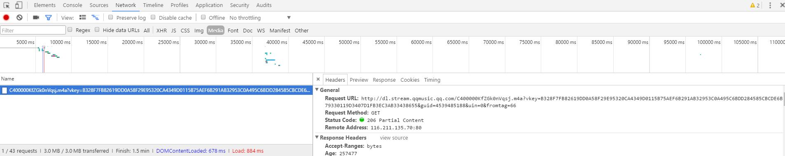
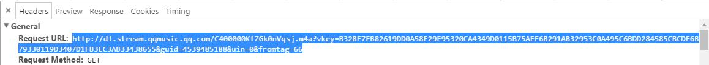
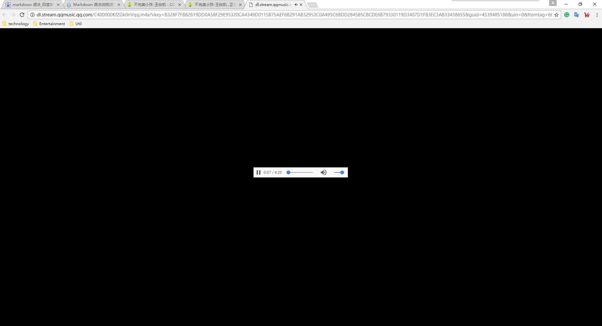
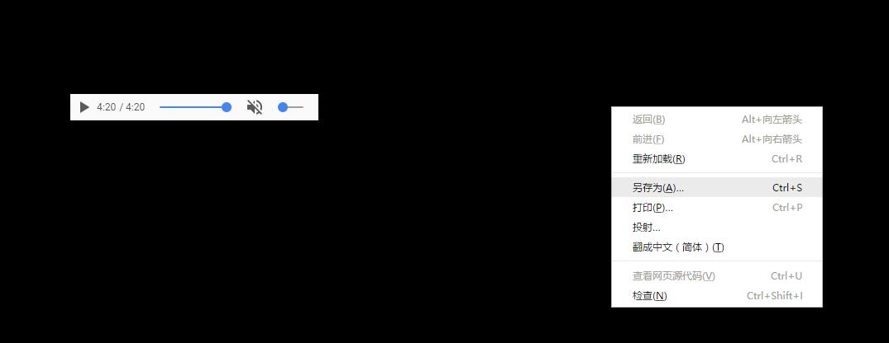

# 下载QQ音乐收费音乐教程  
写QQ音乐爬虫的时候发现QQ音乐的收费音乐可以用特殊的方法下载下来，写个教程造福人民，同时自己练习一下用Markdown写文档  
其他音乐平台也可以试试本方法，道理是通的。    
## 准备工具 
* 电脑
* 浏览器（本教程以Chrome浏览器为例，其他浏览器的方法可以举一反三）
## 第一步  
打开[QQ音乐网页版](https://y.qq.com/)，找到你想下载的收费音乐，例如[《不完美的小孩》](https://y.qq.com/n/yqq/song/000KfZGk0nVqsj.html)  
 
## 第二步  
点击播放，会在新窗口中弹出播放器  

## 第三步
既然是下载收费音乐，那就不能使用正常的方式下载了，点击F12键，打开开发者工具，几乎所有浏览器都自带开发者工具  
 
选择Network(或网络)面板  ↓↓
  
选择Media（或媒体）  ↓↓  

## 第四步
可以看到面板中空空如也，此时按F5键，刷新页面并播放《不完美的小孩》，可以看到多出一条请求  
  
点击请求的名字，左侧出现请求信息如下  
  
复制左侧的General中的Request URL，即：  
  
## 第五步
在新窗口打开复制的url效果如下↓↓  
  
在页面空白处右击鼠标,选择另存为，将m4a文件保存在桌面↓↓  
  
## 完成
接下来就可以用任意音乐播放器播放这个文件了，虽然是m4a格式的，如果你看的不顺眼，可以把后缀名改成mp3，不影响播放，如果想放到手机里播放，就用QQ传到手机上即可，有些手机里的播放器（如QQ音乐）会自动识别该歌曲的歌名，而不是直接显示文件名，这里提醒大家一下。赶快去下载自己喜欢的歌吧！
